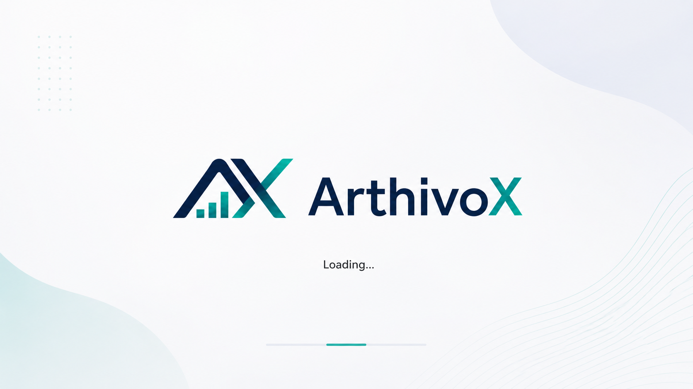
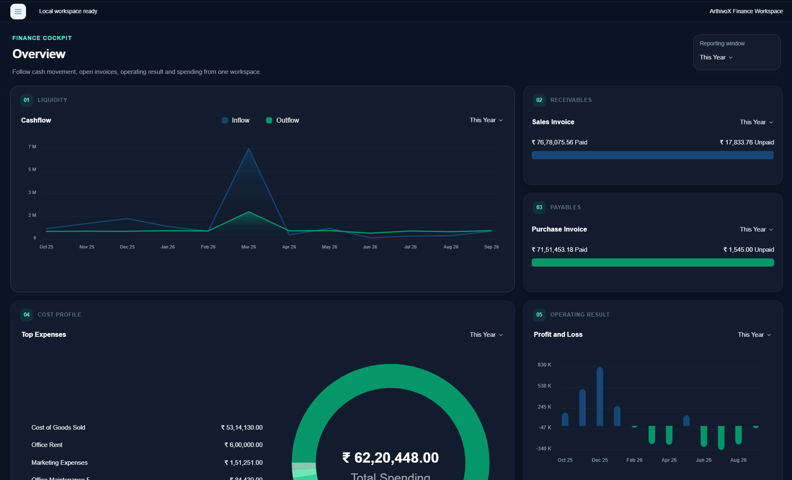

<p align="center">
  
</p>

<h1 align="center">ArthivoX</h1>

<p align="center">
  A modern local-first desktop accounting workspace with secure cloud synchronization and encrypted backups.
</p>

<p align="center">
  <strong>Desktop Accounting · Offline-first · Cloud Sync · Encrypted Backups</strong>
</p>

---

<p align="center">
  
</p>

## Overview

ArthivoX is a desktop accounting application built for businesses that want a focused, modern finance workspace without giving up local control of their accounting data.

The primary company database stays on the user's computer as a local SQLite workspace. ArthivoX Cloud extends that desktop workflow with authentication, linked companies, multi-device synchronization, revision conflict handling, and encrypted cloud backups.

The current desktop release targets Windows and is built with Electron, Vue 3, TypeScript, Vite, SQLite, and Supabase.

## Highlights

- **Local-first accounting** — company data is stored in a local SQLite workspace.
- **Finance cockpit** — cashflow, receivables, payables, spending, and operating results in one overview.
- **Sales workflow** — estimates, customer invoices, customers, products & services, and money received.
- **Purchasing workflow** — vendor bills, suppliers, purchased items, and money paid.
- **General ledger & reports** — inspect account activity and financial movements from a dedicated insights workspace.
- **Tax desk** — GST-oriented reporting workflows including GSTR views.
- **ArthivoX Cloud** — authenticated company linking and multi-device synchronization.
- **Conflict protection** — explicit local-vs-cloud conflict resolution instead of silent overwrites.
- **Encrypted cloud backups** — client-side encrypted SQLite backups before upload.
- **Offline operation** — continue working locally without an active internet connection.
- **Dark and light appearance** — a finance-focused desktop interface designed for long working sessions.

<details>
<summary>Screenshots</summary>
<br/>

    <br/><br/>
    
    <br/><br/>
    

</details>

## ArthivoX Cloud

ArthivoX can optionally connect a local company to ArthivoX Cloud.

Cloud functionality includes:

- email-based authentication
- linked company workspaces
- registered desktop devices
- incremental record synchronization
- local/cloud revision tracking
- conflict detection and resolution
- encrypted SQLite backup storage
- backup sync checkpoints for safer restoration

The accounting database remains a local desktop workspace. Cloud synchronization extends the local workflow rather than replacing it.

## Backup Security

Cloud database backups are encrypted on the client before upload.

The current backup format uses:

- **AES-256-GCM** authenticated encryption
- **PBKDF2-SHA256** key derivation
- random salt and initialization vector
- integrity hashes for encrypted and plaintext data
- a recovery passphrase that is not uploaded with the backup

Users should keep their recovery passphrase in a safe place.

## Technology

| Layer | Technology |
| --- | --- |
| Desktop runtime | Electron |
| Frontend | Vue 3 |
| Language | TypeScript |
| Build tooling | Vite |
| Local database | SQLite / better-sqlite3 |
| Cloud backend | Supabase |
| Authentication | Supabase Auth |
| Cloud database | PostgreSQL |
| Backup storage | Supabase Storage |
| Package manager | Yarn |

## Development

### Requirements

- Node.js 20
- Yarn 1.x
- Windows for the current Windows packaging workflow

Install dependencies:

```bash
yarn install
```

Run type checking:

```bash
yarn typecheck
```

Build application source:

```bash
yarn build:source
```

Build the unsigned Windows installer and portable package:

```bash
yarn build:win:unsigned
```

Windows output is generated under:

```text
dist_electron/bundled/
```

The current Windows packaging workflow produces:

```text
ArthivoX-Setup-v<version>-windows-x64.exe
ArthivoX-Portable-v<version>-windows-x64.exe
win-unpacked/
```

## Project Structure

```text
ArthivoX
├── backend/
├── build/
├── fixtures/
├── fyo/
├── main/
├── models/
├── regional/
├── reports/
├── schemas/
├── src/
├── templates/
├── translations/
└── utils/
```

> `fixtures/` is part of the application setup flow and should not be removed.


---

<p align="center">
  <strong>ArthivoX</strong><br />
  Modern accounting for the desktop.
</p>
